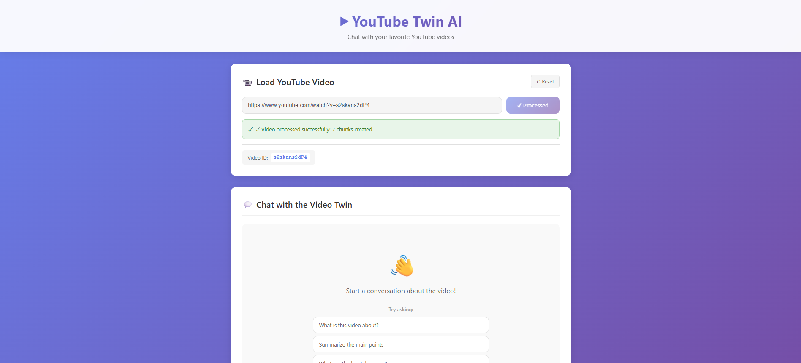
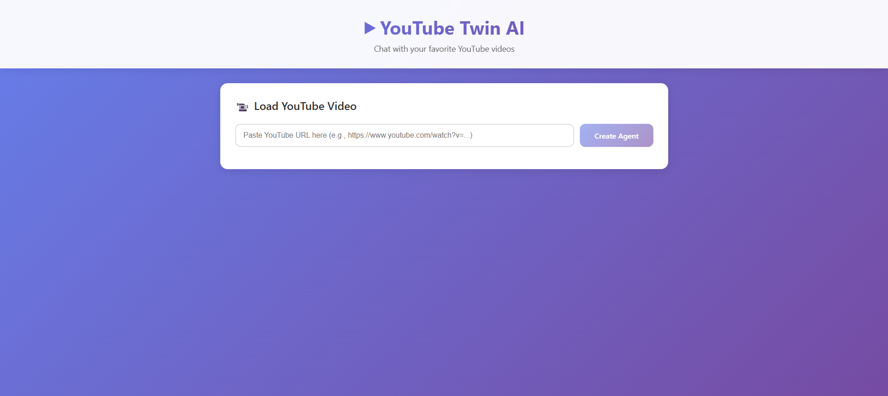

# YouTube Agent


A full-stack application for ingesting YouTube video transcripts and chatting with an AI twin that emulates the speaker's personality and knowledge.

## Prerequisites

- **Python 3.12 or 3.13** (required for the API)
- **Node.js** (v14 or higher) and **npm** (required for the UI)
- **Poetry** (Python dependency management) - [Install Poetry](https://python-poetry.org/docs/#installation)

## Installation

### 1. Clone the Repository

```bash
git clone <repository-url>
cd youtube-agent
```

### 2. Backend Setup (API)

Navigate to the API directory and install dependencies:

```bash
cd api
poetry install
```

### 3. Frontend Setup (UI)

Open a new terminal, navigate to the UI directory, and install dependencies:

```bash
cd ui
npm install
```

### 4. Environment Variables

Create a `.env` file in the `api` directory with the following variables:

```bash
cd api
touch .env
```

Add the following to `api/.env`:

```env
OPENAI_API_KEY=your_openai_api_key_here
PINECONE_API_KEY=your_pinecone_api_key_here
PINECONE_INDEX_NAME=youtube-twin-index
```

**Note:** `PINECONE_INDEX_NAME` is optional and defaults to `youtube-twin-index` if not provided.

## Running the Project

### Start the Backend Server

In the `api` directory, run:

```bash
cd api
uvicorn api.main:app --reload --port 8000 
or 
uvicorn api.main:app --reload --port 8000 --app-dir src
```

The API will be available at `http://localhost:8000`

### Start the Frontend Development Server

In a new terminal, navigate to the `ui` directory and run:

```bash
cd ui
npm start
```

The UI will automatically open in your browser at `http://localhost:3000`

## Project Structure

```
youtube-agent/
├── api/                 # FastAPI backend
│   ├── src/
│   │   └── api/
│   │       ├── main.py      # FastAPI application entry point
│   │       ├── routers/     # API route handlers
│   │       └── utils/       # Utility functions
│   └── pyproject.toml   # Python dependencies
└── ui/                  # React frontend
    ├── src/
    │   ├── components/  # React components
    │   └── services/     # API service layer
    └── package.json     # Node.js dependencies
```

## API Endpoints

- `POST /ingest` - Ingest a YouTube video transcript
- `POST /chat` - Chat with the AI twin about the video

## Troubleshooting

- **Port already in use**: If port 8000 or 3000 is already in use, you can change the ports:
  - Backend: Modify the `--port` flag in the uvicorn command
  - Frontend: Set `PORT=3001` (or another port) before running `npm start`

- **Poetry not found**: Make sure Poetry is installed and in your PATH. You can install it using:
  ```bash
  curl -sSL https://install.python-poetry.org | python3 -
  ```

- **Python version issues**: Ensure you have Python 3.12 or 3.13 installed. Check with:
  ```bash
  python --version
  ```

